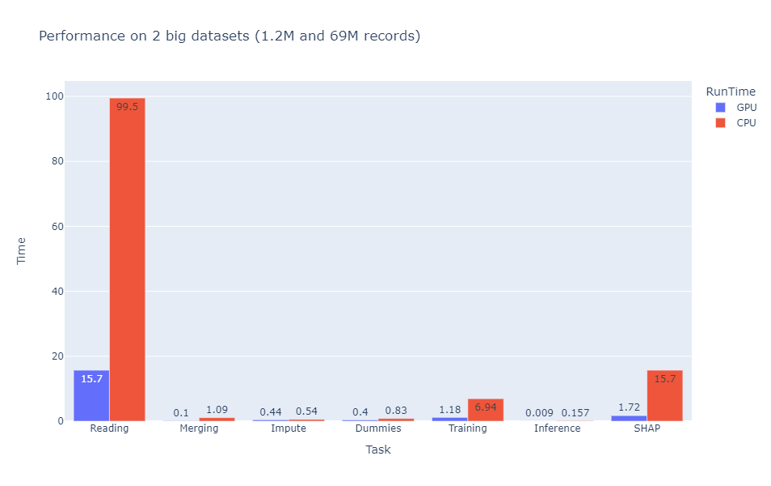
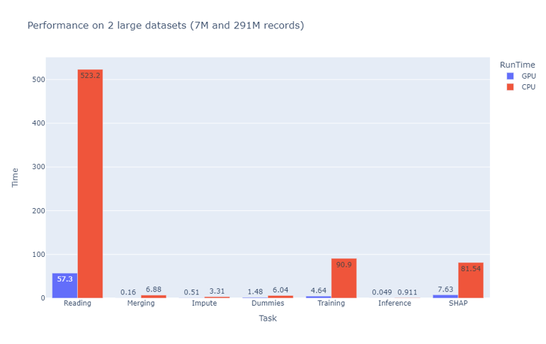

# Credit Risk Prediction

This accelerator demos acceleration on GPUs for structured data by leveraging Nvidia Rapids. While we use Fannie Mae's [single family loan performance dataset](https://capitalmarkets.fanniemae.com/credit-risk-transfer/single-family-credit-risk-transfer/fannie-mae-single-family-loan-performance-data) to predict if a customer is going to be delinquent on the mortgage payments, this can be easily adopted for any huge structured datasets. Most of the preprocessing and model building tasks done by NumPy, Pandas and Scikit-Learn are supported.
* Predict if a customer will be delinquent on credit payment.
* Uses gpu acceleration to significantly reduce the execution time on a structured dataset with millions of records.
* [SHAP](https://github.com/slundberg/shap) to explain the predictions.

## Table of Contents

- [Benchmark and Motivation](#benchmark-and-motivation)
- [Getting Started](#getting-started)
- [Prerequisites](#prerequisites)
- [Deploy Infrastructure](#deploy-infrastructure)
- [Code Structure](#code-structure)
- [Modeling](#modeling)
- [Acknowledgements](#acknowledgements)
- [Contributing](#contributing)
- [Trademarks](#trademarks)

## Benchmark and Motivation

We benchmarked how the [Rapids](https://github.com/rapidsai) suite of libraries with GPU acceleration compares to a power CPU for a typical data science workflow on large datasets. It is observed that the GPU-accelerated workflow is 6-10x faster than the CPU-based workflow depending on the size of the dataset. Bigger the dataset, more the speedup. All this is achieved with a few changes in import statements.

The following tables shows the comparison of the two workflows.


The speedup is even more significant for a larger dataset.


All this at less than half the cost of the compute!

## Getting Started

To get started with this project, follow these steps:
1. Clone the repository to Azure ML workspace or your local machine.
2. Create the environment. Dockerfile can be found [here](configuration/environment/docker/Dockerfile).
3. Download the data by running [download_data](download_data.ipynb).
4. [Train](cudf_credit_risk.ipynb) the model leveraging gpu acceleration.

## Prerequisites

- Access to an Azure subscription
- Access to an Azure ML workspace

## Deploy Infrastructure

A guide to deploy the infrastructure for this project can be found [here](.azureDevOps/Deploy-Infrastructure.md).

## Code Structure
```
├── src/
│   ├── crs_main.py
│   ├── data_preparation/
│   │   └── data_preparation.py
│   ├── performance_and_metrics/
│   │   └── performance_and_metrics.py
├── download_data.ipynb
└── cudf_credit_risk.ipynb
```
The source code resides in the [src](src/) directory. [crs_main](src/crs_main.py) is the main file which connects all the components. 
1. First of all, create the environment in the Azure ML workspace using the [docker file](configuration/environment/docker/Dockerfile). You may name it `credit-risk` as used in the [cudf_credit_risk.ipynb](cudf_credit_risk.ipynb) file.
2. Data has to be downloaded by running the [download_data.ipynb](download_data.ipynb) file. It would download and extract the acquisition and performance files and then uploads these to the default datastore required for running the demo.
3. Data Preparation is specific to this demo and is contained in the [data_preparation](src/data_preparation/data_preparation.py) file. It would read the acquisition and performance raw files related to credit risk and then do the feature engineering including the creation of the target column and implement the imputation logic. You are also welcome to implement your own imputation logic by extending the abstract [Imputation](src/imputation/imputation.py) class.
4. The metrics for evaluating a binary classification model and the utility methods for explaining predictions can be found in [performance_and_metrics](src/performance_and_metrics/performance_and_metrics.py).

[cudf_credit_risk.ipynb](cudf_credit_risk.ipynb) is the central file that would provision the compute, connect the default datastore where the data is already downloaded to the run, load the already created environment and then run the experiment. It would also load the files related to performance, metrics and explainability.

## Modeling

XGBoost is the machine learning model used for training since it supports GPU-accelerated histogram-based algorithm for constructing decision trees during training. This significantly speeds up the training process for large datasets. However, it may not always be faster than the CPU-based algorithm for smaller datasets. 
However, you are encouraged to add your ML algorithm by creating a class similar to [XGBClassificationModel](src/model/classsification_model.py). It would require you to add methods for training and predictions.

## Acknowledgements

This code has been adapted to Azure from the awesome [Nvidia's repository](https://github.com/NVIDIA/fsi-samples/tree/main/credit_default_risk).

## Contributing

This project welcomes contributions and suggestions.  Most contributions require you to agree to a
Contributor License Agreement (CLA) declaring that you have the right to, and actually do, grant us
the rights to use your contribution. For details, visit https://cla.opensource.microsoft.com.

When you submit a pull request, a CLA bot will automatically determine whether you need to provide
a CLA and decorate the PR appropriately (e.g., status check, comment). Simply follow the instructions
provided by the bot. You will only need to do this once across all repos using our CLA.

This project has adopted the [Microsoft Open Source Code of Conduct](https://opensource.microsoft.com/codeofconduct/).
For more information see the [Code of Conduct FAQ](https://opensource.microsoft.com/codeofconduct/faq/) or
contact [opencode@microsoft.com](mailto:opencode@microsoft.com) with any additional questions or comments.

## Trademarks

This project may contain trademarks or logos for projects, products, or services. Authorized use of Microsoft 
trademarks or logos is subject to and must follow 
[Microsoft's Trademark & Brand Guidelines](https://www.microsoft.com/en-us/legal/intellectualproperty/trademarks/usage/general).
Use of Microsoft trademarks or logos in modified versions of this project must not cause confusion or imply Microsoft sponsorship.
Any use of third-party trademarks or logos are subject to those third-party's policies.
